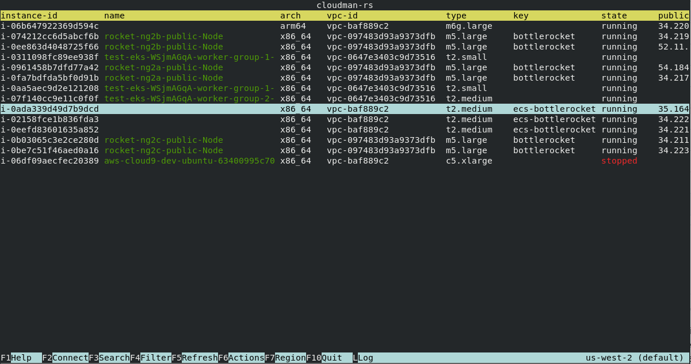
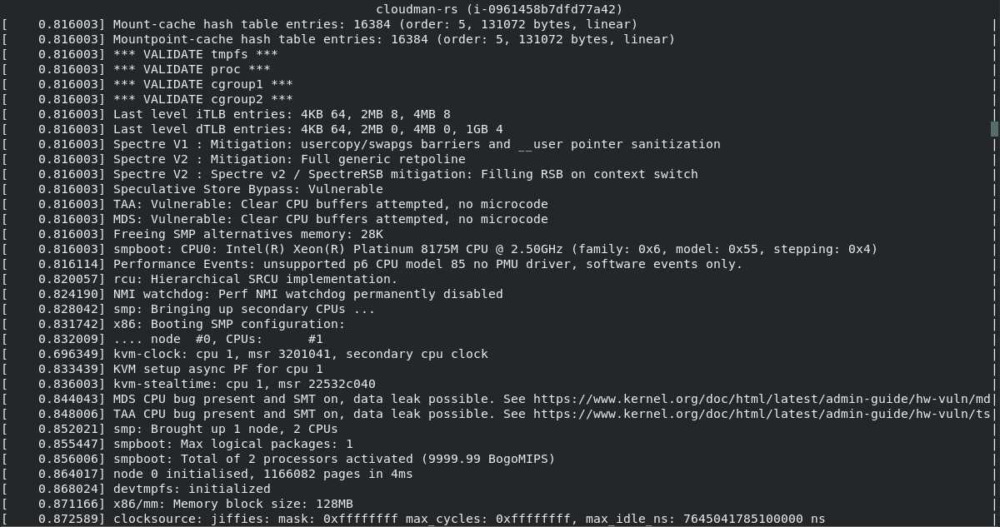

# Cloudman
----------
Cloudman is a textual user interface (heavily inspired by htop) to manage your Amazon EC2 fleet instantly. By using Cloudman you'll find an overview of your instances, navigate through regions, retrieve instance details, show console outputs and connect to instance terminal using SSM.

The profiles and defaults as configured in ~/.aws/credentials will be used. 

[](https://travis-ci.org/github/dutchcoders/cloudman)
[](https://crates.io/crates/cloudman)
[](https://repology.org/project/cloudman/badges)

### Screenshots





## Usage
Cloudman can be started optionally with a region and profile to use. 

```
cloudman-rs 0.1.0
Remco Verhoef <remco@dutchcoders.io>

USAGE:
    cloudman [OPTIONS]

FLAGS:
    -h, --help       Prints help information
    -V, --version    Prints version information

OPTIONS:
    -p, --profile <profile>
    -r, --region <region>

```

## Shortcuts

| Shortcut  | Description |
| ------------- | ------------- |
| F1 | display help |
| F2 | connect using [ssm](https://docs.aws.amazon.com/AWSEC2/latest/UserGuide/session-manager.html) to instance |
| F3 | search through displayed instances |
| F4 | filter displayed instances |
| F5 | refresh displayed instances |
| F6 | show actions for instances |
| F7 | switch region |
| L  | display console output for instance |
| ESC  | close window |
| Q  | quit |

## Installation

If you're a **macOS Homebrew** or a **Linuxbrew** user, then you can install
cloudman from homebrew tap:

```
$ brew install dutchcoders/cloudman
```

## Building
cloudman is written in Rust, so you'll need to grab a
[Rust installation](https://www.rust-lang.org/) in order to compile it.
cloudman compiles with Rust 1.44.0 (stable) or newer. In general, cloudman tracks
the latest stable release of the Rust compiler.

To build cloudman:

```
$ git clone https://github.com/dutchcoders/cloudman
$ cd cloudman
$ cargo build --release
$ ./target/release/cloudman --version
0.1.0
```

## Current features
* switch between region
* connect using SSM to instance (using tmux)
* search through and filter instances

# Features
* start and stop instances
* request spot instances
* modifyable columns
* sorting
* help
* show filter active
* show indicator of loading
* search through log
* actions

## Contributions

Contributions are welcome.

## Creators

**Remco Verhoef**

- <https://twitter.com/remco_verhoef>
- <https://twitter.com/dutchcoders>


## Copyright and license

Code and documentation copyright 2011-2020 Remco Verhoef.

Code released under [the MIT license](LICENSE).
